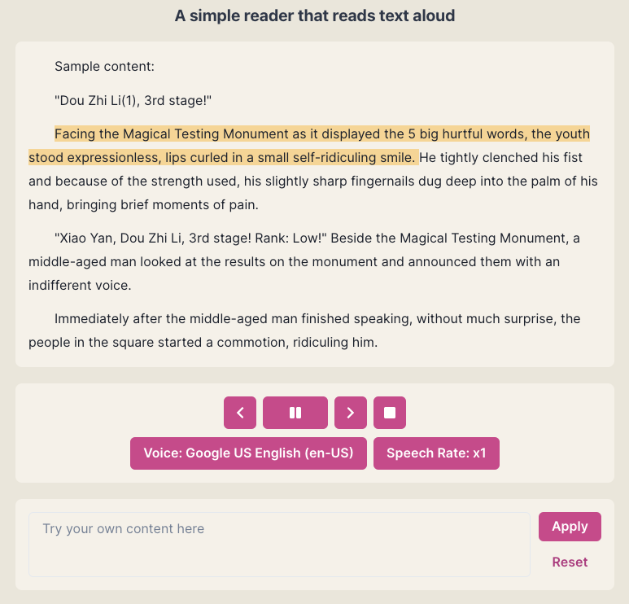

# TTS Reader
This is a simple POC to explore the capability of client side SpeechSynthesis API under the mobile PWA environment

## Getting Started

The online demo is avaiable [here](https://tts-reader.songyih.cc/)

To start the project locally, install dependencies with:
```bash
yarn
```
Then run
```bash
yarn dev
```

Open [http://localhost:3000](http://localhost:3000) with your browser to see the result.



## Resources

- This is a [Next.js](https://nextjs.org/) project bootstrapped with [`create-next-app`](https://github.com/vercel/next.js/tree/canary/packages/create-next-app).
- Text-to-Speech: [SpeechSynthesis](https://developer.mozilla.org/en-US/docs/Web/API/SpeechSynthesis)
- UI Components: [Chakra](https://chakra-ui.com/), [react-icons](https://react-icons.github.io/react-icons/)
- Progressive Web App support: [next-pwa](https://github.com/shadowwalker/next-pwa)
